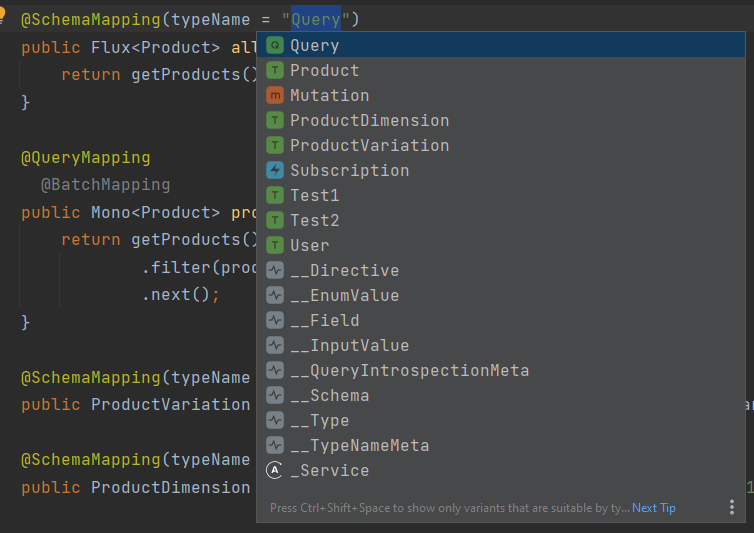
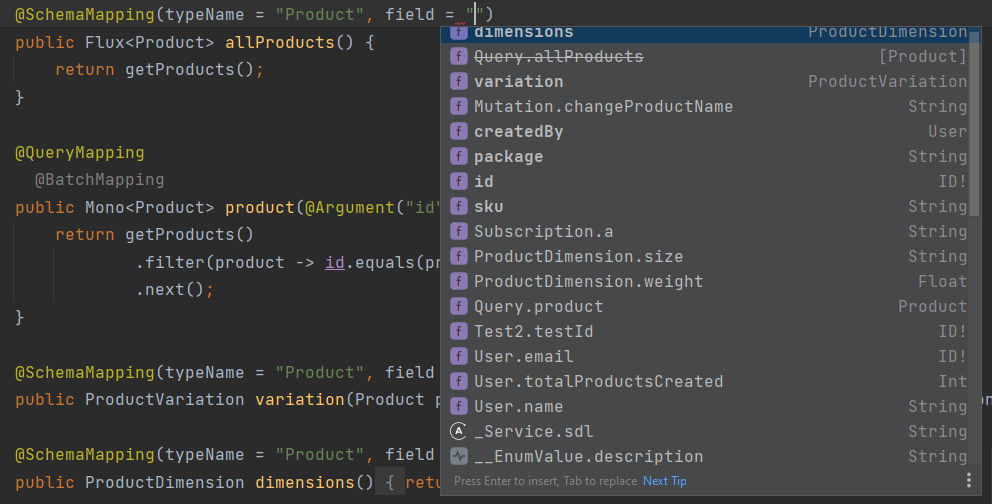
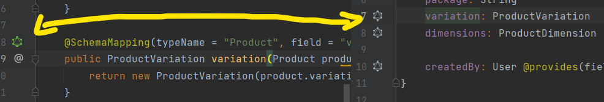
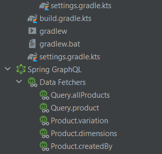
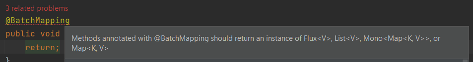

# Spring GraphQL Support for IntelliJ IDEA (Ultimate Edition)

:warning: CURRENTLY IN DEVELOPMENT

<!-- Plugin description -->

This plugin adds support for [Spring GraphQL](https://spring.io/projects/spring-graphql).

**The plugin is currently Work in Progress. Follow development on the [jord1e/spring-graphql-intellij-plugin GitHub repository](https://github.com/jord1e/spring-graphql-intellij-plugin).**

Features:

- Autocompletion of types and fields in @SchemaMapping annotations
- Navigation between method mappings and the schema
- Various inspections
- Data fetchers in project view
- Autocompletion for @Argument names
<!-- Plugin description end -->

## Installation

- Using IDE built-in plugin system:

  <kbd>Settings/Preferences</kbd> > <kbd>Plugins</kbd> > <kbd>Marketplace</kbd> > <kbd>Search for "Spring GraphQL Support"</kbd> >
  <kbd>Install Plugin</kbd>

- Manually:

  Download the [latest release](https://github.com/jord1e/spring-graphql-intellij-plugin/releases/latest) and install it manually using
  <kbd>Settings/Preferences</kbd> > <kbd>Plugins</kbd> > <kbd>⚙️</kbd> > <kbd>Install plugin from disk...</kbd>

## Screenshots

### Type Autocompletion

### Field Autocompletion

### Navigate between types

### Data Fetchers in your project view

### More inspections

## Attribution

Much of the initial development was inspired by the [DGS plugin](https://github.com/Netflix/dgs-intellij-plugin).

This plugin reuses `apollo.svg`, `apollo_dark.svg`, `query.svg`, and `fragment.svg` icons from the [GraphQL plugin](https://github.com/jimkyndemeyer/js-graphql-intellij-plugin) (MIT).

This plugin uses (modified) [JetBrains icons](https://jetbrains.design/intellij/resources/icons_list/) (predominantly Apache 2.0).
